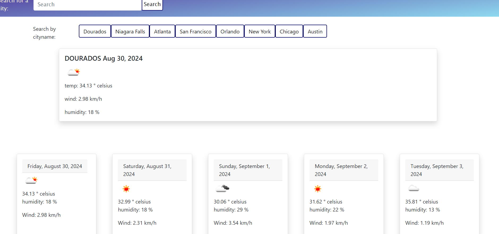

# Farias weather
  
  
## Description

Weather application by using openWeather API, the Technologies were basic HTML,
CSS and JavaScript, the first button its the city that a born and the second the city that I live.

## Usage
You can search by a city name, it will show the today's weather, icon, temperature, wind speed and humidity and the nexts 5 days.

    

## Credits
I had some help from bootCamp lectures, xpert learning, MDN web and google.

the icon code:
https://stackoverflow.com/questions/44177417/how-to-display-openweathermap-weather-icon

## Deployed page
https://jaquelineesteves.github.io/weather-dashboard/

## Repository:
https://github.com/jaquelineesteves/weather-dashboard

